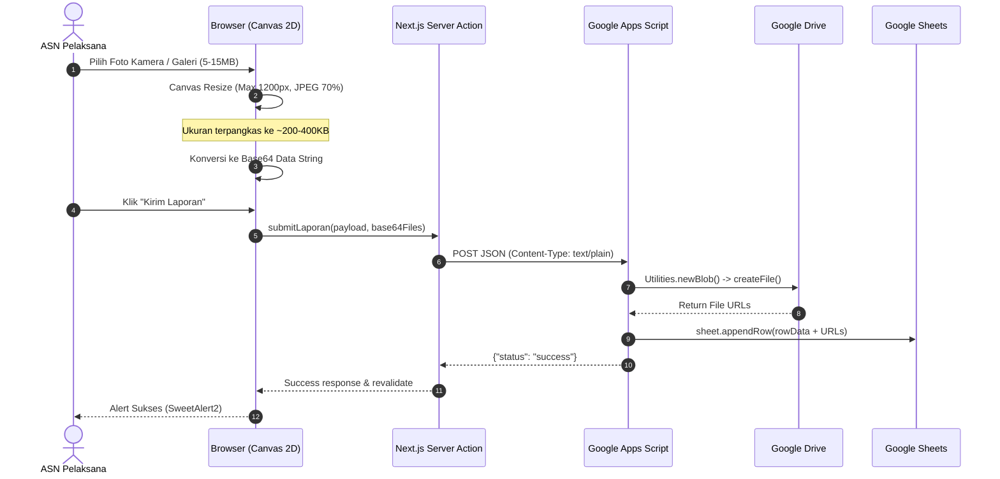
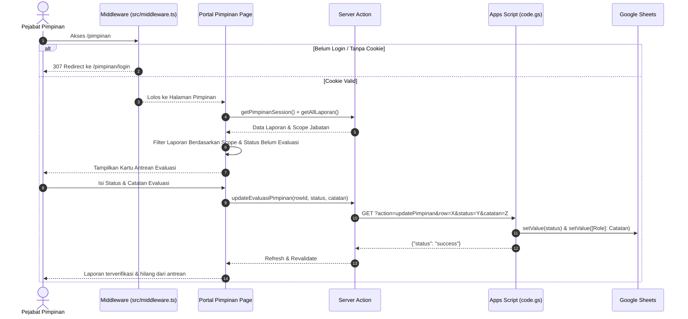

# Dokumen Arsitektur Sistem (System Architecture)
# SIMPELGAS — Sistem Monitoring Penugasan & Laporan Kegiatan ASN
### Dinas Tenaga Kerja Kota Surakarta

---

Dokumen ini menyajikan cetak biru arsitektur teknis (*technical architecture blueprint*), topologi sistem, pemisahan lapisan logika, pola integrasi, mekanisme keamanan, serta penanganan aliran data end-to-end pada aplikasi **SIMPELGAS** (v2.0.0).

---

## 1. Ikhtisar Arsitektur (Architectural Overview)

SIMPELGAS mengadopsi pola arsitektur **Hybrid Serverless BFF (Backend-for-Frontend) + Cloud Workspace Native Datastore**. Arsitektur ini dirancang untuk memberikan pengalaman aplikasi web modern berkinerja tinggi (*zero-latency feeling*) kepada aparatur sipil negara tanpa membebani anggaran instansi dengan biaya sewa basis data/server cloud bulanan (seperti PostgreSQL/Supabase yang sebelumnya digunakan).

```
+----------------------------------------------------------------------------------------------------+
|                                           PRESENTATION TIER                                        |
|  - Next.js 14 Client Components (React 18, Tailwind CSS, Lucide Icons)                             |
|  - Client-side Image Pre-processing (HTML5 Canvas -> JPEG 70%, 1200px limit)                      |
|  - Interactive Feedback (SweetAlert2, Recharts Donut & Bar Charts)                                |
|  - Print Engine (Hidden Isolated Iframe with Custom A4 Stylesheet)                                 |
+-------------------------------------------------+--------------------------------------------------+
                                                  |
                                                  | HTTPS / FormData / JSON
                                                  v
+----------------------------------------------------------------------------------------------------+
|                                    APPLICATION & GATEWAY TIER (BFF)                                |
|  - Next.js 14 App Router (Node.js Server Environment)                                              |
|  - Edge Route Protection (src/middleware.ts with HTTP-Only Cookie Session)                         |
|  - Mutation Handlers (src/lib/actions.ts Server Actions with 'use server')                          |
|  - AI Proxy Route (src/app/api/enhance/route.ts)                                                   |
|  - Apps Script Adapter (src/lib/appscript.ts with 302 Redirect Following)                          |
+----------------------+--------------------------+-------------------------+------------------------+
                       |                          |                         |
          HTTPS / JSON |             HTTPS / JSON |            HTTPS / JSON |
                       v                          v                         v
+------------------------------+ +--------------------------------+ +--------------------------------+
|     COGNITIVE ENGINE         | |     SERVERLESS BACKEND ENGINE  | |     OFFICIAL MEDIA PROXY       |
|  Google Gemini AI            | |  Google Apps Script Web App    | |  lh3.googleusercontent.com     |
|  - Model: gemini-2.5-flash   | |  (code.gs deployed as WebApp)  | |  - Direct Image Streaming      |
|  - Formal Indonesian NLP     | |  - doGet() Action Dispatcher   | |  - CORS & Cookie Bypass        |
|                              | |  - doPost() File & Row Storage | |                                |
+------------------------------+ +---------------+----------------+ +--------------------------------+
                                                 |
                               +-----------------+-----------------+
                               |                                   |
                               v                                   v
                +------------------------------+    +------------------------------+
                |     PRIMARY DATABASE         |    |      OBJECT MEDIA STORAGE    |
                |  Google Spreadsheet Engine   |    |  Google Drive Storage Engine |
                |  - Sheet: DATA_PEGAWAI       |    |  - Folder: Dokumentasi (Foto)|
                |  - Sheet: REKAP_LAPORAN      |    |  - Folder: Materi (Dokumen)  |
                +------------------------------+    +------------------------------+
```

---

## 2. Lapisan Arsitektur (Architectural Layers)

### 2.1 Lapisan Presentasi (Presentation Layer)
* **Teknologi**: React 18, Next.js App Router Client Components (`'use client'`), Tailwind CSS, Recharts, Lucide Icons.
* **Tanggung Jawab**:
  * Menampilkan antarmuka pengguna interaktif dan responsif (desktop, tablet, mobile).
  * Validasi input formulir di sisi klien (*client-side form validation*).
  * Melakukan kompresi citra berbasis HTML5 Canvas 2D sebelum konversi Base64 untuk meminimalkan beban transfer jaringan.
  * Menangani render lembar cetak standar kedinasan pada iframe terisolasi untuk menghindari konflik CSS layar.

### 2.2 Lapisan Server / Backend-for-Frontend (BFF Layer)
* **Teknologi**: Next.js 14 Server Actions (`'use server'`), Route Handlers, Node.js runtime.
* **Komponen Inti**:
  1. `src/middleware.ts`: Mengamankan seluruh rute `/pimpinan/*` menggunakan pembacaan cookie HTTP-Only secara stateless pada edge level.
  2. `src/lib/actions.ts`: Berisi logika mutasi data (`submitLaporan`, `updateEvaluasiPimpinan`, `loginPimpinan`), otentikasi sesi pimpinan, serta server-side image fetching (`getDirectImageBase64`).
  3. `src/lib/appscript.ts`: Lapisan adapter tangguh (*resilient adapter*) yang mengabstraksi komunikasi HTTP ke Google Apps Script Web App, menangani normalisasi tanggal, pemetaan data, dan toleransi format nama.
  4. `src/app/api/enhance/route.ts`: Endpoint proksi aman yang menghubungkan klien ke Google Gemini AI tanpa mengekspos API Key rahasia ke browser.

### 2.3 Lapisan Backend Serverless (Execution Layer)
* **Teknologi**: Google Apps Script (V8 Runtime Engine) pada file `code.gs`.
* **Tanggung Jawab**:
  * `doGet(e)`: Menerima query parameter `action` (`getPegawai`, `getLaporan`, `updatePimpinan`), membaca range data dari Spreadsheet, dan mengembalikan payload JSON.
  * `doPost(e)`: Menerima payload JSON Base64 dokumen dan dokumentasi foto, membuat Blob biner, menyimpannya ke folder Google Drive yang sesuai, dan menyisipkan baris baru (*appendRow*) pada sheet `REKAP_LAPORAN`.
  * Menangani perizinan eksekusi cloud di bawah akun dinas resmi.

### 2.4 Lapisan Penyimpanan (Persistence & Storage Layer)
* **Google Spreadsheet (Database Relasional Virtual)**:
  * `DATA_PEGAWAI`: Tabel master aparatur (NIP, Nama, Bidang/Unit Kerja, Jabatan).
  * `REKAP_LAPORAN`: Tabel transaksi penugasan (Waktu, Pegawai, Bidang, Jenis, Catatan, URL Drive, Status, Evaluasi).
* **Google Drive (Object Storage)**:
  * `PARENT_FOLDER_ID`: Wadah penyimpanan dokumen.
  * Sub-folder otomatis: `Dokumentasi Kegiatan (File responses)` dan `Materi (Jika Ada) (File responses)`.

---

## 3. Pola Arsitektur Utama (Core Architectural Patterns)

### 3.1 Pola Server Actions & Cache Revalidation
Untuk menghindari data lama (*stale data*) yang sering terjadi saat menggunakan integrasi spreadsheet pihak ketiga:
1. Setiap fungsi pembacaan data di `src/lib/actions.ts` memanggil `unstable_noStore as noStore()` dari `next/cache`.
2. Halaman App Router (`src/app/dashboard/page.tsx`, `src/app/cetak/page.tsx`, `src/app/pimpinan/page.tsx`) dideklarasikan dengan `export const dynamic = 'force-dynamic'`.
3. Setelah mutasi data (misalnya `submitLaporan` atau `updateEvaluasiPimpinan`) berhasil dieksekusi di Apps Script, Server Action langsung memicu `revalidatePath()` untuk menyinkronkan cache Next.js secara instan:
   ```typescript
   revalidatePath('/dashboard')
   revalidatePath('/cetak')
   revalidatePath('/pimpinan')
   ```

### 3.2 Pola Kompresi Citra Klien & Streaming Base64
Menghindari kegagalan batas ukuran payload (payload limit) dan timeout pada Google Apps Script:


### 3.3 Pola Bypass CORS Media Google Drive untuk Naskah Cetak
Google Drive secara default membatasi embedding gambar di iframe pihak ketiga melalui pembatasan cookie / Cross-Origin Resource Policy:
* **Solusi SIMPELGAS**:
  1. Di sisi server (`src/lib/actions.ts`), fungsi `getDirectImageBase64(url)` mengunduh gambar menggunakan streaming Node.js dari URL thumbnail Google Drive (`https://lh3.googleusercontent.com/d/{id}=w800`).
  2. Gambar diubah menjadi Data URL Base64 (`data:image/jpeg;base64,...`).
  3. Dokumen HTML iframe cetak menyematkan Base64 secara langsung, menjamin gambar muncul 100% saat dialog cetak browser dipanggil tanpa ada gambar yang rusak (*broken image icon*).

---

## 4. Diagram Aliran Data (Data Flow Diagrams)

### 4.1 Aliran Evaluasi Bertingkat Portal Pimpinan


---

## 5. Arsitektur Keamanan (Security Architecture)

### 5.1 Isolasi Kredensial & Secrets Management
* Seluruh kredensial rahasia disimpan di file `.env` lingkungan server:
  * `APPSCRIPT_URL`: URL Web App Google Apps Script.
  * `GEMINI_API_KEY`: Kunci API Google AI Studio.
  * `PIN_KEPALA_DINAS`, `PIN_SEKRETARIS`, `PIN_KABID_*`, `PIN_KASUBAG_*`: Kunci PIN akses peran struktural.
* **Prinsip Zero Client Exposure**: Variabel-variabel di atas tidak memiliki awalan `NEXT_PUBLIC_`, sehingga dijamin tidak pernah di-bundle ke file JavaScript yang diunduh oleh peramban pengguna.

### 5.2 Pengamanan Sesi Berbasis Cookie
* Login portal pimpinan menerbitkan cookie sesi `pimpinan_session` dengan atribut:
  * `httpOnly: true`: Mencegah pembacaan cookie oleh script jahat di sisi klien (anti XSS session hijacking).
  * `sameSite: 'lax'`: Mencegah serangan Cross-Site Request Forgery (CSRF).
  * `secure: process.env.NODE_ENV === 'production'`: Memaksa transmisi hanya melalui protokol terenkripsi HTTPS.
  * `maxAge: 28800`: Masa aktif dibatasi 8 jam (sesuai jam kerja dinas).

### 5.3 Validasi Scope Data Berbasis Peran (RBAC)
Penyaringan data diterapkan secara ganda (pada UI client dan pada server logic):
* **Kepala Dinas & Sekretaris**: Scope `ALL` (seluruh unit kerja).
* **Kabid PPTK**: Scope `BIDANG PPTK`.
* **Kabid Hubungan Industrial**: Scope `BIDANG HUBUNGAN INDUSTRIAL`.
* **Kasubag Perkeu / AKO**: Scope `SEKRETARIAT` dengan filter tambahan hanya untuk jenjang pegawai `Staff` (tidak menampilkan laporan antar pejabat struktural).

---

## 6. Ketersediaan & Ketahanan Sistem (High Availability & Resilience)

| Potensi Masalah | Dampak | Strategi Mitigasi Arsitektural |
| :--- | :--- | :--- |
| **HTTP 302 Redirect Google Apps Script** | Request gagal di klien jika fetch tidak mengikuti redirect | Adapter `src/lib/appscript.ts` menyematkan opsi `redirect: 'follow'` pada setiap panggilan fetch. |
| **CORS Preflight Block pada POST Apps Script** | Request browser gagal dengan status CORS error | Body POST dikirim menggunakan header `text/plain;charset=utf-8` bukan `application/json`, sehingga dianggap sebagai *simple request* yang tidak memicu preflight `OPTIONS`. |
| **Variasi Penulisan Nama Pegawai** | Relasi laporan dan profil pegawai tidak cocok karena perbedaan gelar | Fungsi `normalizePersonName()` mengeliminasi gelar, spasi ganda, dan karakter non-alfanumerik sebelum pencocokan ID. |
| **Ukuran Berkas Melebihi Kuota Server Action** | Error `Request body larger than maxBodySize` | `next.config.js` meningkatkan limit menjadi `10mb`, dan klien mengompresi foto ke JPEG 70% sebelum di-encode. |
| **Quota Harian Google Apps Script** | Batas kuota harian execution time akun Google | Pemanggilan API difokuskan hanya untuk operasi esensial (`getPegawai`, `getLaporan`, `submit`, `update`). Operasi agregasi statistik dijalankan di memori server Next.js (`getDashboardStats`). |

---

## 7. Rencana Penggelaran (Deployment Architecture)

```
[ Git Repository ]
       |
       +---> GitHub / GitLab CI
                |
                +---> [ Docker Container / Vercel Node.js Runtime ]
                            |
                            |-> Next.js 14 Web Application (SIMPELGAS)
                            |-> Port: 3000 (HTTP/HTTPS via Reverse Proxy Nginx)
                            |
                            +--- Connects via HTTPS to ---> [ Google Apps Script Web App ]
                                                                     |
                                                                     +---> Google Spreadsheet & Drive
```

* **Persyaratan Lingkungan Server**:
  * Node.js v20.x atau lebih baru (LTS).
  * Reverse Proxy Nginx dengan SSL/TLS aktif (Certbot Let's Encrypt).
  * Google Apps Script Web App di-deploy dengan pengaturan:
    * *Execute as*: **Me (pemilik akun dinas)**.
    * *Who has access*: **Anyone**.
