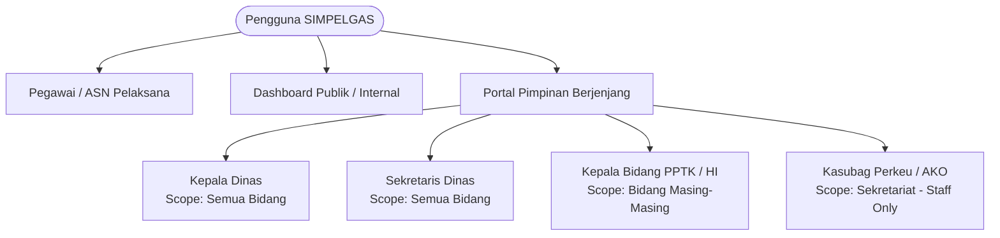

# Product Requirements Document (PRD)
# SIMPELGAS — Sistem Monitoring Penugasan & Laporan Kegiatan ASN
### Dinas Tenaga Kerja Kota Surakarta

---

| Parameter Dokumen | Informasi |
| :--- | :--- |
| **Nama Produk** | SIMPELGAS (Sistem Informasi Monitoring Penugasan & Laporan Kegiatan ASN) |
| **Versi Produk** | 2.0.0 (Production Stable) |
| **Instansi Pemilik** | Dinas Tenaga Kerja Kota Surakarta (Pemerintah Kota Surakarta) |
| **Target Pengguna** | ASN Pelaksana, Pejabat Pengawas (Kasubag), Pejabat Administrator (Kabid/Sekretaris), Pejabat Pimpinan Tinggi Pratama (Kepala Dinas) |
| **Status Dokumen** | Disetujui & Terimplementasi (Living Architecture Specification) |
| **Tanggal Pembaruan** | 2 September 2026 |

---

## 1. Ringkasan Eksekutif & Latar Belakang

### 1.1 Latar Belakang
Dinas Tenaga Kerja Kota Surakarta memiliki intensitas penugasan kedinasan yang tinggi, baik penugasan internal kota, penugasan antar instansi/OPD, rapat koordinasi luar daerah, hingga sosialisasi dan bimbingan teknis ketenagakerjaan. Pada operasional konvensional, pelaporan hasil penugasan mengalami kendala signifikan:
1. **Pencatatan Tercecer & Hilangnya Jejak Informasi**: Laporan fisik sering menumpuk atau tidak terdokumentasi rapi, menyulitkan pelacakan historis hasil rapat dan arahan instansi mitra.
2. **Lambatnya Tindak Lanjut Pimpinan**: Disposisi atau evaluasi dari Pimpinan (Kepala Dinas/Kabid) membutuhkan waktu lama karena lembar laporan fisik harus diedarkan secara estafet.
3. **Format Tidak Baku & Inkonsisten**: Ringkasan laporan yang dibuat aparatur memiliki variasi gaya bahasa yang tidak selalu memenuhi standar tata naskah dinas resmi.
4. **Dokumentasi Kegiatan Terfragmentasi**: Berkas foto dan materi paparan tersimpan secara terpisah di perangkat pribadi masing-masing pegawai, rentan hilang dan sulit diakses saat dibutuhkan audit/SPJ.

### 1.2 Tujuan Produk
SIMPELGAS versi 2.0 dibangun untuk memodernisasi tata kelola penugasan aparatur dengan mengintegrasikan:
- **Pelaporan Digital Berbasis Web** yang responsif dan dapat diakses dari smartphone maupun PC kantor.
- **Kecerdasan Buatan (AI Text Enhancement)** menggunakan Google Gemini Flash untuk memperbaiki tata bahasa dan merapikan catatan hasil kegiatan ke dalam format kedinasan resmi tanpa mengubah substansi.
- **Backend Tanpa Biaya Berlangganan Server (Serverless Google Apps Script)** yang tersinkronisasi otomatis dengan Google Spreadsheet kedinasan dan penyimpanan dokumen Google Drive.
- **Portal Pimpinan Berjenjang** yang memungkinkan pimpinan melakukan verifikasi, disposisi, dan evaluasi berkala langsung dengan keamanan PIN.
- **Cetak Lembar Laporan Kedinasan Standar A4** lengkap dengan Kop Surat resmi Pemkot Surakarta yang siap dicetak/diarsipkan.

---

## 2. Persona & Hak Akses Pengguna

Sistem membedakan pengguna berdasarkan fungsi operasional dan hak akses struktural:



### 2.1 Persona Pegawai / ASN Pelaksana
* **Tugas**: Melaksanakan penugasan dinas, mendokumentasikan kegiatan, membuat laporan kegiatan, dan mencetak lembar laporan untuk SPJ.
* **Fitur Utama**:
  * Mengakses form input laporan (`/input`).
  * Memanfaatkan tombol AI untuk menyempurnakan catatan notulensi.
  * Mengunggah bukti foto dokumentasi (dikompres otomatis di sisi klien) dan materi dokumen.
  * Mencari dan mencetak laporan mandiri dalam format kedinasan resmi (`/cetak`).

### 2.2 Persona Pimpinan Struktural
* **Otentikasi**: Login melalui Portal Pimpinan (`/pimpinan/login`) dengan memilih Jabatan dan memasukkan PIN Keamanan 6 Digit (tersimpan di environment variable server).
* **Kewenangan Berdasarkan Hierarki**:
  1. **Kepala Dinas & Sekretaris Dinas**:
     * Akses: Seluruh bidang (**Scope: ALL**).
     * Fokus: Evaluasi strategis laporan kebijakan tinggi, penugasan antar-daerah, dan disposisi tindak lanjut teknis.
  2. **Kepala Bidang (Kabid PPTK & Kabid Hubungan Industrial)**:
     * Akses: Hanya laporan dari bidang teknis yang dipimpinnya (**Scope: BIDANG PPTK** / **BIDANG HUBUNGAN INDUSTRIAL**).
     * Fokus: Evaluasi operasional kegiatan lapangan dan bimbingan teknis.
  3. **Kepala Sub Bagian (Kasubag Perkeu & Kasubag AKO)**:
     * Akses: Bidang **SEKRETARIAT** khusus jenjang pegawai **Staff** (tidak mengevaluasi laporan sesama pejabat pengawas/administrator).
* **Fitur Utama**:
  * Melihat daftar antrean laporan yang **belum dievaluasi oleh jabatannya**.
  * Menentukan status tindak lanjut: `Untuk Diketahui` atau `Perlu Tindak Lanjut Bidang Teknis`.
  * Menuliskan catatan/arahan pimpinan yang secara otomatis tercatat dengan atribusi jabatan `[Role]: Catatan`.
  * Melakukan ekspor data rekapitulasi evaluasi ke Excel (`.xlsx`) dan PDF (`.pdf`).

---

## 3. Arsitektur Sistem & Aliran Data

### 3.1 Topologi Arsitektur

SIMPELGAS mengadopsi pola **Hybrid Modern Web Framework + Cloud Drive Native Data Store**:

```
+---------------------------------------------------------------------------------+
|                                 CLIENT TIER                                     |
|  - Next.js 14 Client Components (React 18, Tailwind CSS, Lucide Icons)          |
|  - Client-side Image Compression (HTML5 Canvas 2D -> JPEG 70%, <= 1200px)       |
|  - File Encoding to Base64 String                                               |
|  - SweetAlert2 & Dynamic Recharts UI                                            |
+---------------------------------------------------------------------------------+
                                         |
                                         | HTTPS (FormData / JSON via Server Actions)
                                         v
+---------------------------------------------------------------------------------+
|                             NEXT.JS 14 APP ROUTER                               |
|  - Node.js Server Environment (Edge Middleware Authentication)                 |
|  - src/lib/actions.ts (Server Actions with noStore() & revalidatePath())        |
|  - src/lib/appscript.ts (Google Apps Script API Adapter & Resilient Fetcher)    |
|  - src/app/api/enhance/route.ts (Gemini 2.5 Flash Proxy)                        |
|  - next.config.js: serverActions.bodySizeLimit = '10mb'                         |
+------------------------------------+--------------------------------------------+
                                     |
                +--------------------+--------------------+
                |                                         |
                v                                         v
+------------------------------------+ +------------------------------------------+
|      GOOGLE GEMINI AI API          | |      GOOGLE APPS SCRIPT WEB APP          |
|  (gemini-2.5-flash)                | |  (code.gs deployed as Web App)           |
|  - Natural Language Refinement     | |  - doGet(e): action query routing        |
|  - Formal Indonesian Kedinasan     | |  - doPost(e): base64 decode & upload     |
+------------------------------------+ +--------------------+---------------------+
                                                            |
                                        +-------------------+-------------------+
                                        |                                       |
                                        v                                       v
                         +-----------------------------+         +------------------------------+
                         |     GOOGLE SPREADSHEET      |         |         GOOGLE DRIVE         |
                         |  - Sheet: DATA_PEGAWAI      |         |  - Folder: Dokumentasi (Foto)|
                         |  - Sheet: REKAP_LAPORAN     |         |  - Folder: Materi (Dokumen)  |
                         +-----------------------------+         +------------------------------+
```

### 3.2 Alur Data (Data Flow)

#### 1. Alur Input Laporan & Unggah Berkas:
1. Pengguna memilih **Bidang** -> Dropdown Pegawai otomatis memfilter daftar pegawai dari sheet `DATA_PEGAWAI`.
2. Pengguna mengisi detail formulir (jenis penugasan, tanggal, tempat, tamu, catatan).
3. Pengguna dapat mengklik tombol **"Perbaiki Teks dengan AI"** -> Klien memanggil `/api/enhance` -> Gemini AI merapikan catatan menjadi format kedinasan.
4. Lampiran foto dikompresi di browser menggunakan HTML5 Canvas (maksimal 1200px, 70% quality, <1MB) dan dikonversi ke Base64.
5. Klien memanggil Server Action `submitLaporan()` -> Server Next.js meneruskan payload JSON ke `doPost` Google Apps Script.
6. Google Apps Script menyimpan berkas fisik ke Google Drive (`saveFilesToDrive`), mengambil link URL Google Drive, dan menyematkannya ke baris baru sheet `REKAP_LAPORAN`.
7. Next.js melakukan invalidasi cache via `revalidatePath('/dashboard')`, `revalidatePath('/pimpinan')`, dan `revalidatePath('/cetak')`.

#### 2. Alur Evaluasi Pimpinan:
1. Pimpinan membuka portal `/pimpinan`, middleware memeriksa cookie `pimpinan_session`.
2. Sistem menyaring laporan berdasarkan hak akses bidang dan menyaring laporan yang sudah pernah dievaluasi oleh peran tersebut (mendeteksi tag `[Nama Role]`).
3. Pimpinan mengisi status (`Untuk Diketahui` atau `Perlu Tindak Lanjut`) dan memberikan catatan arahan.
4. Server Action `updateEvaluasiPimpinan()` memanggil `updateEvaluasiInAppsScript()` yang menembak `doGet` Apps Script dengan parameter `action=updatePimpinan`.
5. Apps Script memperbarui baris spreadsheet pada kolom `Status Tindak Lanjut` dan `Catatan Pimpinan`.

---

## 4. Spesifikasi Fungsional Rinci

### Modul 1: Master Data Pegawai & Unit Kerja
* **Kode Kebutuhan**: `FR-PEG-01`
* **Sumber Data**: Sheet `DATA_PEGAWAI` pada Google Spreadsheet.
* **Struktur Kolom**:
  * `NIP`: Nomor Induk Pegawai (18 digit) atau kode identifikasi.
  * `Nama Pegawai`: Nama lengkap beserta gelar.
  * `Bidang / Unit Kerja`: Unit kerja induk (misal: `SEKRETARIAT`, `BIDANG PPTK`, `BIDANG HUBUNGAN INDUSTRIAL`).
  * `Jabatan`: Jabatan kedinasan (Kepala Dinas, Sekretaris, Kabid, Kasubag, Pengantar Kerja, Staff, dsb.).
* **Fungsionalitas**:
  * Pengambilan data secara dinamis tanpa hardcode melalui Server Action `getPegawai()`.
  * Fallback mapping yang toleran terhadap perbedaan nama kolom (`NIP` vs `nip`, `Nama Pegawai` vs `nama`).
  * Normalisasi teks toleran gelar untuk mencocokkan laporan dengan master pegawai (`normalizePersonName`).

### Modul 2: Formulir Pelaporan Penugasan (`/input`)
* **Kode Kebutuhan**: `FR-INP-01`
* **Elemen Input**:
  * `Bidang / Unit Kerja` (*Required* - Dropdown dinamis).
  * `Nama Pegawai` (*Required* - Dependent Dropdown berdasarkan bidang yang dipilih).
  * `Jenis Penugasan` (*Required* - Rapat Koordinasi, Sosialisasi/Bimtek, Monitoring & Evaluasi, Kunjungan Kerja, Lainnya).
  * `Tanggal Kegiatan` (*Required* - HTML5 Date input).
  * `Nama Kegiatan` (*Required* - Input teks).
  * `Tempat Kegiatan` (*Required* - Input teks).
  * `Penyelenggara Kegiatan` (*Required* - Input teks).
  * `Tamu Undangan / Peserta yang Hadir` (*Optional* - Input teks).
  * `Catatan Hasil Kegiatan` (*Required* - Textarea dengan dukungan AI).
  * `Dokumentasi Foto` (*Multiple Files* - Dukungan unggah gambar dengan auto-compress).
  * `Materi / Paparan` (*Multiple Files* - Format PDF, DOCX, XLSX, PPTX, maks 5MB).
* **Fitur Cerdas**:
  * **Client-side Compression**: Mengompres gambar sebelum Base64 encoding untuk mencegah payload transfer membengkak dan mempercepat pengiriman data ke Google Apps Script.
  * **Loading Overlay**: Modal blur interaktif yang mengunci form selama proses encoding dan pengiriman data untuk mencegah pengiriman ganda (*double-submission*).

### Modul 3: AI-Powered Text Enhancement (`/api/enhance`)
* **Kode Kebutuhan**: `FR-AI-01`
* **Model**: Google Gemini (`gemini-2.5-flash`).
* **SOP Prompting Kedinasan**:
  * Mengoreksi salah ketik (*typo*), ejaan, dan tanda baca bahasa Indonesia formal.
  * Mempertahankan struktur poin-poin (*bullet points* atau *numbered list*).
  * Melarang halusinasi, penambahan fakta fiktif, serta tidak mengubah angka, tanggal, nama orang, maupun instansi.
  * Mengembalikan format teks bersih tanpa kutipan markdown atau format tebal berlebih.

### Modul 4: Dashboard Eksekutif & Statistik Interaktif (`/dashboard`)
* **Kode Kebutuhan**: `FR-DSH-01`
* **Indikator Kinerja Utama (KPI Cards)**:
  * **Total Penugasan**: Jumlah seluruh laporan penugasan yang tercatat dalam sistem.
  * **Pegawai Terlibat**: Jumlah unik pegawai yang telah membuat dan mengunggah laporan penugasan + statistik rata-rata penugasan per pegawai.
  * **Evaluasi Pimpinan**: Jumlah laporan yang telah di-ACC / memiliki catatan evaluasi pimpinan + progres persentase evaluasi.
* **Visualisasi Grafis (Recharts)**:
  * **Donut Chart**: Distribusi proporsi laporan berdasarkan Bidang / Unit Kerja.
  * **Ranked Horizontal Bar Chart**: Frekuensi kegiatan berdasarkan Jenis Penugasan.
* **Fitur Filter Multi-Parameter**:
  * Filter Bidang (Semua / Sekretariat / PPTK / Hubungan Industrial).
  * Filter Status Tindak Lanjut (Semua / Untuk Diketahui / Perlu Tindak Lanjut).
  * Filter Periode Bulan (Januari s.d. Desember tahun berjalan).
  * Filter Rentang Tanggal Presisi (`Tanggal Mulai` s.d. `Tanggal Selesai`).
* **Tabel Rekapitulasi & Modal Detail**:
  * Tabel data interaktif dengan paginasi (10 baris per halaman).
  * Badge status visual: Hijau untuk `Untuk Diketahui`, Oranye untuk `Perlu Tindak Lanjut`.
  * Tombol aksi **"Lihat Detail"** yang memunculkan modal komprehensif berisi seluruh rincian laporan, galeri dokumentasi foto, link unduh materi, jejak catatan pimpinan, dan tombol pintas ke lembar cetak.
* **Ekspor Excel**:
  * Ekspor seluruh data terfilter ke format spreadsheet Excel (`.xlsx`) via modul `xlsx` dengan header terstruktur.

### Modul 5: Cetak Lembar Laporan Kedinasan (`/cetak`)
* **Kode Kebutuhan**: `FR-PRT-01`
* **Standar Tata Naskah Dinas**:
  * Kop Surat Resmi: Logo Pemerintah Kota Surakarta (`Pemkot.png`), teks instansi bertingkat `PEMERINTAH KOTA SURAKARTA`, `DINAS TENAGA KERJA`, alamat, kontak, dan garis dobel hitam tebal-tipis standar dinas.
  * Standar Ukuran Kertas: A4 Portrait (margin standar arsip 15mm top/bottom, 20mm left/right).
  * Tipografi: Times New Roman 11pt, spasi baris 1.35, teks rata kiri-kanan (*justify*).
* **Struktur Lembar Cetak**:
  1. Header Kop Surat Kedinasan.
  2. Judul Dokumen: `LAPORAN HASIL PENUGASAN`.
  3. Tabel Identitas Petugas (Nama, NIP, Pangkat/Golongan, Jabatan, Unit Kerja).
  4. Tabel Rincian Pelaksanaan Tugas (Dasar Tugas, Jenis, Tanggal, Tempat, Penyelenggara, Tamu Hadir).
  5. Isi Hasil Kegiatan (Diformat rapi dari bullet points menjadi list HTML kedinasan melalui `formatRichTextForPrint`).
  6. Dokumentasi Foto Kegiatan (Grid foto 2 kolom dengan page break protection `.anti-potong`).
  7. Lembar Catatan/Disposisi Pimpinan dan Kolom Tanda Tangan Resmi.
* **Mekanisme Cetak Bebas CORS**:
  * Server Action `getDirectImageBase64()` mengunduh file gambar Google Drive di level server dan mengirimkannya dalam format Data URL Base64 ke iframe cetak, menjamin gambar muncul 100% tanpa kendala *cross-origin iframe* atau blokir adblocker.

### Modul 6: Portal Pimpinan & Evaluasi Terproteksi (`/pimpinan`)
* **Kode Kebutuhan**: `FR-PIM-01`
* **Otentikasi & Keamanan**:
  * Login dengan PIN numerik yang divalidasi di sisi server (variabel `PIN_*` di `.env`).
  * Sesi berbasis Cookie HTTP-Only (`pimpinan_session`) dengan durasi 8 jam.
  * Next.js Middleware (`src/middleware.ts`) memproteksi seluruh rute di bawah `/pimpinan/*`.
* **Workflow Evaluasi Berkelanjutan**:
  * Laporan yang belum dievaluasi oleh role aktif ditampilkan sebagai kartu interaktif.
  * Pimpinan dapat memilih status: `Untuk Diketahui` atau `Perlu Tindak Lanjut Bidang Teknis`.
  * Catatan baru digabungkan secara kronologis ke catatan sebelumnya dengan format `[Nama Jabatan]: Catatan Arahan`.
  * Fitur ekspor rekapitulasi khusus pimpinan ke Excel dan PDF untuk bahan rapat pimpinan dinas.

---

## 5. Kontrak Data & Spesifikasi Antarmuka

### 5.1 Skema Data Google Spreadsheet

#### Sheet 1: `DATA_PEGAWAI`
| Kolom | Tipe | Keterangan |
| :--- | :--- | :--- |
| `NIP` | String | Nomor Induk Pegawai 18 Digit atau ID unik |
| `Nama Pegawai` | String | Nama lengkap pegawai beserta gelar |
| `Bidang / Unit Kerja` | String | Nama bidang dinas (SEKRETARIAT, BIDANG PPTK, dsb.) |
| `Jabatan` | String | Jabatan fungsional atau struktural |

#### Sheet 2: `REKAP_LAPORAN`
| Kolom | Tipe | Contoh / Keterangan |
| :--- | :--- | :--- |
| `Nama Pegawai` | String | Budi Santoso, S.Sos |
| `Bidang` | String | BIDANG PPTK |
| `Jenis Penugasan` | String | Rapat Koordinasi |
| `Tanggal Kegiatan` | String | Format penyimpanan: `DD/MM/YYYY` |
| `Nama Kegiatan` | String | Rapat Evaluasi Pelatihan Vokasi |
| `Tempat Kegiatan` | String | Ruang Rapat Werkudara Lantai 2 |
| `Penyelenggara Kegiatan`| String | Disnakertrans Provinsi Jawa Tengah |
| `Tamu Undangan yang Hadir` | String | Kepala Dinas se-Solo Raya |
| `Catatan Hasil Kegiatan` | String | Poin-poin resume kegiatan |
| `Dokumentasi Kegiatan` | String | URL file Google Drive (dipisahkan baris baru `\n`) |
| `Materi (Jika Ada)` | String | URL materi Google Drive (dipisahkan baris baru `\n`) |
| `Status Tindak Lanjut` | String | `Untuk Diketahui` / `Perlu Tindak Lanjut Bidang Teknis` |
| `Catatan Pimpinan` | String | Riwayat evaluasi berlabel `[Role]: Catatan` |

### 5.2 Kontrak API Google Apps Script (`code.gs`)

#### A. Endpoint `GET` (`doGet(e)`)
1. **Ambil Master Pegawai**:
   * Request: `GET ${APPSCRIPT_URL}?action=getPegawai`
   * Response:
     ```json
     {
       "status": "success",
       "data": [
         {
           "NIP": "198501012010011001",
           "Nama Pegawai": "Budi Santoso",
           "Bidang / Unit Kerja": "BIDANG PPTK",
           "Jabatan": "Pengantar Kerja Ahli Muda"
         }
       ]
     }
     ```
2. **Ambil Laporan Kegiatan**:
   * Request: `GET ${APPSCRIPT_URL}?action=getLaporan[&nama=...]`
   * Response:
     ```json
     {
       "status": "success",
       "data": [
         {
           "Row_Index": 2,
           "Nama Pegawai": "Budi Santoso",
           "Bidang": "BIDANG PPTK",
           "Tanggal Kegiatan": "25/08/2026",
           "Nama Kegiatan": "Sosialisasi Pemagangan",
           "Status Tindak Lanjut": "Untuk Diketahui",
           "Catatan Pimpinan": "[Kepala Dinas]: Lanjutkan koordinasi"
         }
       ]
     }
     ```
3. **Pembaruan Evaluasi Pimpinan**:
   * Request: `GET ${APPSCRIPT_URL}?action=updatePimpinan&row={rowIndex}&status={status}&catatan={catatan}`
   * Response: `{"status": "success"}`

#### B. Endpoint `POST` (`doPost(e)`)
* Request: `POST ${APPSCRIPT_URL}`
* Headers: `Content-Type: text/plain;charset=utf-8` (menghindari CORS pre-flight issue pada Google Apps Script).
* Payload:
  ```json
  {
    "namaPegawai": "Budi Santoso",
    "bidang": "BIDANG PPTK",
    "jenisPenugasan": "Rapat Koordinasi",
    "tanggalKegiatan": "2026-08-25",
    "namaKegiatan": "Koordinasi Pemagangan",
    "tempatKegiatan": "Semarang",
    "penyelenggara": "Disnakertrans Prov Jateng",
    "tamuUndangan": "Para Kabid PPTK",
    "catatanHasil": "Poin hasil kegiatan...",
    "dokumentasi": [
      {
        "base64": "/9j/4AAQSkZJRg...",
        "name": "foto_kegiatan_1.jpg",
        "mime": "image/jpeg"
      }
    ],
    "materi": [
      {
        "base64": "JVBERi0xLjQK...",
        "name": "paparan_materi.pdf",
        "mime": "application/pdf"
      }
    ]
  }
  ```

---

## 6. Kebutuhan Non-Fungsional (Non-Functional Requirements)

### 6.1 Performa & Penanganan Bandwidth
* **Klien Ringan**: Foto wajib dikompresi di sisi browser sebelum dikirim (maksimal sisi terpanjang 1200 piksel dan kualitas JPEG 70%). Berkas berukuran 5-10 MB berhasil diperkecil menjadi 200-400 KB tanpa mengurangi keterbacaan dokumen.
* **Server Action Buffer**: Batas transmisi Next.js Server Action dikonfigurasi sebesar `10mb` di `next.config.js` untuk mengakomodasi dokumen materi PDF dan multi-foto kegiatan.
* **Caching & Invalidasi Presisi**: Penggunaan `unstable_noStore()` pada pembacaan data spreadsheet untuk mencegah pembacaan data basi (*stale cache*), dikombinasikan dengan pemanggilan `revalidatePath()` saat mutasi berhasil.

### 6.2 Keamanan & Privasi
* **Tanpa Eksposur Kredensial**: URL Apps Script (`APPSCRIPT_URL`) dan API Key Gemini (`GEMINI_API_KEY`) hanya disimpan pada environment variable sisi server dan tidak boleh memiliki prefiks `NEXT_PUBLIC_`.
* **Sesi Pimpinan Terenkripsi**: Cookie sesi pimpinan menggunakan atribut `httpOnly: true`, `sameSite: 'lax'`, dan `secure` pada mode produksi, mencegah pencurian sesi via serangan Cross-Site Scripting (XSS).
* **Isolasi Folder Google Drive**: File disimpan di folder induk khusus (`PARENT_FOLDER_ID`) yang dikelola oleh akun Google Workspace resmi kedinasan.

### 6.3 Keandalan & Toleransi Kesalahan (Reliability & Fault Tolerance)
* **Pencocokan Nama Fleksibel**: Sistem menyertakan utilitas `normalizePersonName()` yang membersihkan tanda baca, gelar akademis, serta spasi ganda, menjamin sinkronisasi relasi pegawai dan laporan tetap konsisten meskipun nama ditulis dengan variasi gelar.
* **Bypass CORS Media**: Gambar dokumentasi di-proxy melalui Server Action `getDirectImageBase64()` saat masuk ke mode cetak untuk menjamin gambar selalu tampil meskipun ada pembatasan referrer/cookie dari Google Drive.

### 6.4 Kompatibilitas Perangkat & Browser
* Mendukung seluruh peramban modern (Google Chrome, Mozilla Firefox, Microsoft Edge, Safari Mobile).
* Tata letak antarmuka adaptif: Sidebar desktop yang dapat dilipat (*collapsible*), dan laci navigasi mobile (*mobile off-canvas drawer*).

---

## 7. Rencana Pengembangan Masa Depan (Roadmap)

| Prioritas | Fitur | Status | Estimasi |
| :---: | :--- | :--- | :--- |
| **P1** | Re-Aktivasi Modul Monitoring Internal | Backlog — Schema TypeScript tersedia | Sprint berikutnya |
| **P2** | Integrasi Notifikasi WhatsApp / Telegram | Backlog | Setelah P1 selesai |
| **P3** | Penyimpanan Tanda Tangan Digital (e-Signature / QR) | Backlog | Jangka panjang |

1. **[P1] Re-Aktivasi Modul Monitoring Internal**:
   Mengaktifkan kembali pencatatan kegiatan internal kantor (rapat internal dinas, sosialisasi internal, status kelengkapan SPJ, notulen rapat, dan daftar hadir) yang skema TypeScript-nya sudah disiapkan di `src/lib/types.ts`.
2. **[P2] Integrasi Notifikasi WhatsApp / Telegram**:
   Mengirim notifikasi otomatis kepada Pimpinan ketika ada laporan penugasan mendesak yang membutuhkan tindak lanjut segera.
3. **[P3] Penyimpanan Tanda Tangan Digital (e-Signature / QR Verification)**:
   Menyematkan QR Code validasi pada lembar cetak laporan yang dapat dipindai untuk memverifikasi keaslian dokumen secara langsung.

---
*Dokumen ini dibuat dan divalidasi berdasarkan arsitektur nyata kode sumber SIMPELGAS v2.0.*
