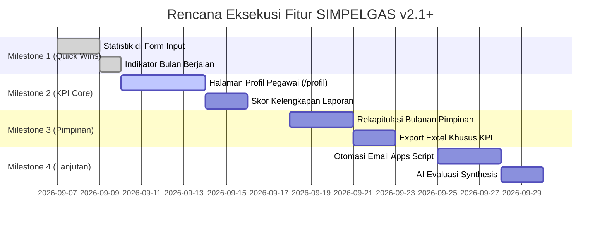

# Rencana Pengembangan Fitur SIMPELGAS (v2.1+)
## Peningkatan KPI Pegawai & Keterbukaan Informasi Pelaporan Kedinasan
### Dinas Tenaga Kerja Kota Surakarta
> Terakhir diperbarui: 2026-09-04 · Status: Draft Rencana Strategis

---

## 1. Latar Belakang & Visi Transformasi

**SIMPELGAS (Sistem Informasi Monitoring Penugasan dan Laporan Kegiatan ASN)** versi saat ini (v2.0.0) telah berhasil menjadi sistem pencatatan penugasan terpusat yang handal, cepat (*zero-lag*), dan terintegrasi dengan Google Sheets & Drive melalui Google Apps Script.

Namun, pada implementasi saat ini, SIMPELGAS masih berfungsi dominan sebagai **sistem pelaporan pasif (one-way reporting)**:
1. Pegawai memasukkan data penugasan luar/internal.
2. Data tersimpan di spreadsheet.
3. Pimpinan membaca dan memberikan evaluasi status tindak lanjut.

**Visi Transformasi SIMPELGAS v2.1+**:
Mengubah SIMPELGAS dari sekadar *formulir input & arsip cetak* menjadi **Platform Kinerja & Informasi Terbuka ASN**, di mana setiap pegawai mendapatkan umpan balik langsung mengenai kontribusi kedinasan mereka (KPI personal), transparansi catatan evaluasi pimpinan, dan motivasi kualitas pelaporan.

---

## 2. Analisis Kebutuhan & Persona Pengguna

### 2.1 Pegawai Pelaksana & Fungsional (ASN)
- **Problem**: Sering lupa berapa kali sudah ditugaskan dalam bulan berjalan, tidak tahu apakah laporannya sudah dibaca/disetujui pimpinan, serta tidak memiliki rekap portofolio penugasan pribadi.
- **Kebutuhan**: 
  - Tahu seketika status pelaporan bulan ini saat membuka form input.
  - Halaman personal untuk melihat seluruh riwayat dan catatan pimpinan atas laporan mereka.
  - Petunjuk jelas mengenai standar kelengkapan bukti dokumentasi penugasan.

### 2.2 Pimpinan (Kadis, Sekdin, Kabid, Kasubag)
- **Problem**: Membutuhkan waktu lama untuk merekap siapa saja pegawai yang aktif ditugaskan dan siapa yang belum pernah ditugaskan dalam suatu periode evaluasi.
- **Kebutuhan**:
  - Matriks rekapitulasi KPI penugasan bulanan per pegawai secara otomatis.
  - Indikator kualitas pelaporan (kelengkapan foto, notulen, materi).
  - Ringkasan eksekutif untuk bahan rapat pimpinan atau penilaian SKP tahunan.

---

## 3. Matriks Rekomendasi Fitur

Fitur-fitur berikut dikelompokkan berdasarkan prioritas dan dampak terhadap basis data yang ada:

| No | Fitur | Prioritas | Kompleksitas | Dampak Database / Sheets |
|:--:|:---|:---:|:---:|:---|
| 1 | **Statistik Cepat & Riwayat di Form Input** | 🔥 **P1** | Rendah | **Nol (Zero Change)** — Menggunakan data yang ada |
| 2 | **Portal Profil KPI Pegawai (`/profil`)** | 🔥 **P1** | Menengah | **Nol (Zero Change)** — Filter client/server existing |
| 3 | **Skor Kelengkapan Laporan (0–100)** | ⭐ **P2** | Rendah | **Nol** (Komputasi dinamis) atau +1 kolom opsional |
| 4 | **Rekap KPI Bulanan di Portal Pimpinan** | ⭐ **P2** | Menengah | **Nol** — Agregasi data di dashboard |
| 5 | **Target & Progress Bar Bulanan** | 🌟 **P3** | Rendah | Konfigurasi Environment Variable |
| 6 | **Otomasi Pengingat Laporan (Email)** | 🌟 **P3** | Menengah | Tambah trigger di `code.gs` + kolom email |
| 7 | **Ringkasan AI Evaluasi Pimpinan** | 💎 **P4** | Menengah | Memanfaatkan route `/api/enhance` |
| 8 | **Portofolio Digital Penugasan ASN** | 💎 **P4** | Tinggi | Fitur lanjutan rute publik terproteksi |

---

## 4. Rincian Teknis & Spesifikasi Fitur

### 4.1 Statistik Cepat di Form Input (Quick Win P1)
* **Konsep**: Ketika pegawai memilih namanya pada dropdown `Nama Pegawai`, sebuah panel informasi personal ringkas langsung muncul di bawah dropdown.
* **Informasi yang Ditampilkan**:
  - Jumlah penugasan yang telah dilaporkan pada bulan berjalan.
  - Tanggal dan nama kegiatan penugasan terakhir.
  - Status evaluasi laporan terakhir (misal: `✅ Untuk Diketahui` atau `⚠️ Perlu Tindak Lanjut`).
* **Keunggulan**: Membantu pegawai (terutama pegawai senior) langsung mengonfirmasi bahwa laporan sebelumnya sudah berhasil masuk tanpa perlu navigasi ke menu lain.
* **Implementasi**: Menggunakan data `initialLaporan` yang difilter secara reaktif berdasarkan `selectedPeg.nama`.

---

### 4.2 Portal Profil & Kartu KPI Pegawai (`/profil`) (P1)
* **Konsep**: Menu baru di navigasi utama yang memungkinkan pegawai memilih nama mereka atau mencari rekan kerja untuk melihat ringkasan kontribusi kedinasan.
* **Komponen Halaman**:
  1. **Header Pegawai**: Nama Lengkap, NIP, Jabatan, dan Bidang/Unit Kerja.
  2. **Kartu Metrik KPI (Tahun Berjalan)**:
     - Total Penugasan Dinas (Luar Kota vs. Dalam Kota).
     - Persentase Laporan yang Sudah Dievaluasi Pimpinan.
     - Rata-rata Frekuensi Tugas per Bulan.
  3. **Timeline Penugasan Interaktif**:
     - Daftar kronologis penugasan yang diikuti.
     - Kartu penugasan yang menampilkan foto kegiatan dan catatan umpan balik pimpinan secara transparan.
  4. **Pencarian & Filter Tanggal**: Memudahkan pegawai mengekspor rekap penugasan pribadi untuk keperluan lampiran SKP (Sasaran Kinerja Pegawai).

---

### 4.3 Skor Kelengkapan Laporan (Data Quality Score) (P2)
* **Konsep**: Memberikan penghargaan (*reward score*) otomatis terhadap laporan yang diisi secara tertib dan komprehensif.
* **Algoritma Penilaian (0–100 Poin)**:
  - Foto Dokumentasi valid (minimal 1 foto): **+30 poin**
  - Berkas Materi / Paparan terlampir: **+20 poin**
  - Catatan Hasil Kegiatan terurai baik (≥ 100 karakter): **+30 poin**
  - Daftar Hadir / Tamu Undangan diisi: **+10 poin**
  - Tempat & Penyelenggara terisi jelas: **+10 poin**
* **Tampilan Visual (Badge Standar Civic Spectrum)**:
  - `Skor 90–100`: Badge Hijau `bg-emerald-50 text-emerald-800 border-emerald-300` (*Sangat Lengkap*)
  - `Skor 60–89`: Badge Biru/Kuning `bg-amber-50 text-amber-800 border-amber-300` (*Cukup Lengkap*)
  - `Skor < 60`: Badge Netral `bg-slate-100 text-slate-700 border-slate-300` (*Perlu Dilengkapi*)

---

### 4.4 Rekapitulasi KPI Bulanan di Portal Pimpinan (P2)
* **Konsep**: Tab khusus pada Portal Pimpinan (`/pimpinan`) yang menyajikan tabel matriks bulanan seluruh pegawai di bawah bidangnya.
* **Fitur Tabel**:
  - Kolom: No, Nama Pegawai, NIP, Jabatan, Jumlah Laporan Bulan Ini, Rata-rata Skor Kelengkapan, Status Tindak Lanjut Terbuka.
  - Sorting otomatis: Menampilkan pegawai paling aktif hingga pegawai yang belum ada penugasan sama sekali (indikator *Belum Ada Penugasan* berwarna abu-abu lembut).
  - Tombol aksi: "Lihat Semua Laporan Pegawai Ini" (membuka filter langsung di menu cetak).

---

### 4.5 Target & Progress Bar Bulanan (P3)
* **Konsep**: Menetapkan target pelaporan standar instansi per bulan (misalnya target rata-rata 2–4 penugasan per bulan tergantung jabatan/bidang).
* **Tampilan**: Progress bar elegan di dashboard dan halaman profil personal.
  - Contoh: `Progress Penugasan Bulan Ini: 3 dari 4 Target [█████████░░░] 75%`
* **Manfaat**: Memberikan visualisasi target yang terukur dan objektif untuk evaluasi bulanan.

---

### 4.6 Pengingat Terjadwal Otomatis (Apps Script Trigger) (P3)
* **Konsep**: Memanfaatkan kemampuan *Time-driven Triggers* pada Google Apps Script (`code.gs`).
* **Mekanisme**:
  - Setiap tanggal 25 akhir bulan pukul 09:00 WIB, script berjalan otomatis.
  - Mengecek data laporan bulan berjalan pada `REKAP_LAPORAN`.
  - Mengirimkan email notifikasi santun kepada pegawai yang telah terjadwal bertugas namun belum mengunggah laporan hasil penugasan.

---

### 4.7 Ringkasan AI Catatan Pimpinan (P4)
* **Konsep**: Memanfaatkan endpoint `/api/enhance` (Google Gemini / OpenRouter) untuk mensintesis evaluasi pimpinan terhadap seorang pegawai selama satu semester/tahun.
* **Output AI**:
  - Rangkuman kekuatan kontribusi pegawai (misal: "Sering mewakili dinas dalam forum ketenagakerjaan provinsi dengan catatan pelaporan tepat waktu").
  - Rekomendasi aspek pengembangan berdasarkan catatan tindak lanjut pimpinan.

---

## 5. Rencana Tahapan Rilis (Milestones)

---

## 6. Kepatuhan Standar Teknis & Batasan Arsitektur

Setiap penambahan fitur di atas **wajib mematuhi 5 Aturan Keras UI & Arsitektur** yang telah disepakati:

1. **Aksesibilitas Tinggi (Senior-Friendly)**:
   - Teks tombol dan label wajib kontras tinggi (`text-slate-800` / `font-bold`), rasio kontras > 4.5:1 (WCAG AA/AAA).
   - Dilarang memakai warna teks pastel pudar di atas latar terang.
2. **Desain Token & Ikon**:
   - 100% ikon menggunakan `lucide-react`.
   - 0 penggunaan emoji/emoticon Unicode di antarmuka tombol, kartu, dan notifikasi modal.
   - Menggunakan font sistem resmi **Plus Jakarta Sans**.
3. **Kemandirian Backend Serverless**:
   - Tidak menambah dependensi database eksternal baru (Postgres/MySQL/Supabase). Semua data tetap bersumber dari Google Apps Script Web App.
   - Perubahan skema spreadsheet diminimalkan. Jika tidak mutlak perlu, manfaatkan enrichment di layer Next.js.
4. **Verifikasi 5 Evidence Gates**:
   - Setiap fitur wajib melewati `npm run ci:local` (ESLint 0 warning, Typecheck 0 error, Vitest unit test pass 100%, dan Next.js production build sukses) sebelum di-deploy ke Vercel.
